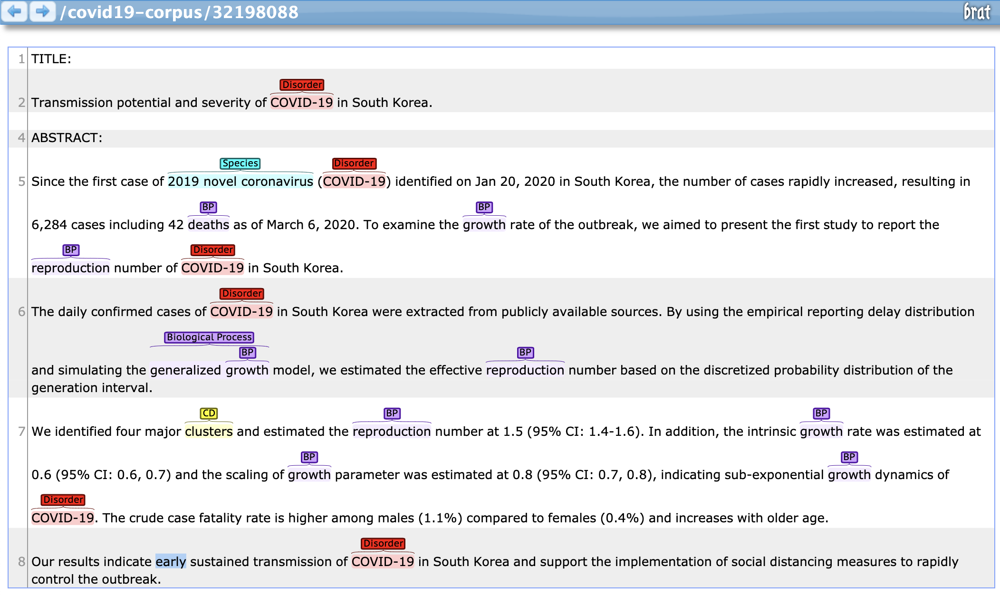

# COVID-19 Corpus
COVID-19 corpus of abstracts from [Pubmed](https://pubmed.ncbi.nlm.nih.gov/) with annotated biomedical entities of interest.

The corpus is **freely available** and can be used to further research topics related with COVID-19, contributing to **find insights** towards a **better understanding of the disease**, in order to **find effective drugs** and reduce the pandemic impact.

# Download
[Download the latest version of the corpus](corpus).

# Statistics
Overall corpus statistics:
- Number of **abstracts**: **17739**
- Number of entity **occurrences**: **627288**
- Number of **unique** entities: **29420**

Number of annotations per entity type:

| Entity | # Occurrences| # Unique |
|--------|--------------|------------|
| Disorder | 165477 | 4476 | 
| Species | 120977 | 2170 |
| Chemical or Drug | 65010 | 2766 |
| Gene or Protein | 47132 | 15025 |
| Enzyme | 7155 | 282 |
| Anatomy | 96236 | 2369 |
| Biological Process | 68233 | 1561 |
| Molecular Function | 13850 | 383 |
| Cellular Component | 37130 | 263 |
| Pathway | 6062 | 97 |
| microRNA | 26 | 28 |

# Structure
Corpus file `corpus/pubmed_YYYYMMDD.zip` contains the following folders:
- **json**: article in JSON format from Pubmed;
- **raw**: article with text only;
- **annotations**: annotations in [A1 format](https://brat.nlplab.org/standoff.html).

On each folder you can find one file per article, with the Pubmed ID on its name.
  
# Get articles
To collect articles related with COVID-19 from Pubmed, the following [query](https://pubmed.ncbi.nlm.nih.gov/?term=%28%222000%22%5BDate+-+Publication%5D+%3A+%223000%22%5BDate+-+Publication%5D%29+AND+%28%28COVID-19%29+OR+%28Coronavirus%29+OR+%28Corona+virus%29+OR+%282019-nCoV%29+OR+%28SARS-CoV%29+OR+%28MERS-CoV%29+OR+%28Severe+Acute+Respiratory+Syndrome%29+OR+%28Middle+East+Respiratory+Syndrome%29+OR+%282019+novel+coronavirus+disease%5BMeSH+Terms%5D%29+OR+%282019+novel+coronavirus+infection%5BMeSH+Terms%5D%29+OR+%282019-nCoV+disease%5BMeSH+Terms%5D%29+OR+%282019-nCoV+infection%5BMeSH+Terms%5D%29+OR+%28coronavirus+disease+2019%5BMeSH+Terms%5D%29+OR+%28coronavirus+disease-19%5BMeSH+Terms%5D%29%29) was applied:
```
("2000"[Date - Publication] : "3000"[Date - Publication]) AND ((COVID-19) OR (Coronavirus) OR (Corona virus) OR (2019-nCoV) OR (SARS-CoV) OR (MERS-CoV) OR (Severe Acute Respiratory Syndrome) OR (Middle East Respiratory Syndrome) OR (2019 novel coronavirus disease[MeSH Terms]) OR (2019 novel coronavirus infection[MeSH Terms]) OR (2019-nCoV disease[MeSH Terms]) OR (2019-nCoV infection[MeSH Terms]) OR (coronavirus disease 2019[MeSH Terms]) OR (coronavirus disease-19[MeSH Terms]))
```

To collect the articles in JSON and then extract the text in raw format:
```bash
python scripts/pubmed/pubmed.py
python scripts/pubmed/json2raw.py
```

# Resources
The following resources were applied to annotated each entity type:
- Disorder (DISO): [UMLS](https://www.nlm.nih.gov/research/umls/index.html)
- Species (SPEC): [NCBI Taxonomy](https://www.ncbi.nlm.nih.gov/taxonomy)
- Chemical or Drug (CHED): [ChEBI](https://www.ebi.ac.uk/chebi/)
- Gene or Protein (PRGE): NER with CRFs and normalization with [UniProt](https://www.uniprot.org)
- Enzyme (ENZY): [ExPASy](https://enzyme.expasy.org)
- Anatomy (ANAT): [Unified Medical Language System (UMLS)](https://www.nlm.nih.gov/research/umls/index.html)
- Biological Process (PROC): [Gene Ontology (GO)](http://geneontology.org) and [UMLS](https://www.nlm.nih.gov/research/umls/index.html)
- Molecular Function (FUNC): [Gene Ontology (GO)](http://geneontology.org)
- Cellular Component (COMP): [Gene Ontology (GO)](http://geneontology.org)
- Pathway (PATH): [NCBI BioSystems](https://www.ncbi.nlm.nih.gov/biosystems)
- microRNA (MRNA): [miRBase](http://www.mirbase.org)

For more details please check the [article](https://doi.org/10.1186/1471-2105-14-281). Unfortunately dictionaries could not be shared for download, due to UMLS usage license. Nevertheless, keep in mind that **Disorder and Species entities were extended to include COVID-19 entities of interest**.

# Annotation
[Neji](https://github.com/BMDSoftware/neji) is the tool used for NER (Named Entity Recognition) and normalization, which is optimized for biomedical scientific articles and provides an easy to use CLI.
For more details please check the [article](https://doi.org/10.1186/1471-2105-14-281).

The annotation script is available at `scripts/pubmed/annotate.sh`.

# Visualization
[brat](https://brat.nlplab.org/) is used to visualize the annotations in the articles. Find below the instructions to run the tool, create corpus for brat and visualize annotations. 

### Install and run brat:
```bash
cd tools
unzip brat-1.3.zip
cd brat-1.3
./install.sh -u
python standalone.py
```

### Create corpus for visualization:
```bash
./scripts/pubmed/brat.sh
ln -s corpus/pubmed/brat tools/brat-1.3/data/covid19-corpus
```
### Visualize corpus:
Go to [http://localhost:8001/index.xhtml#/covid19-corpus/](http://localhost:8001/index.xhtml#/covid19-corpus/) and wait for the articles to load:



# Example
Find below an example article in the provided document formats: JSON, Raw and A1.

### JSON:
```json
{
    "pubmed_id": "32198088",
    "title": "Transmission potential and severity of COVID-19 in South Korea.",
    "abstract": "Since the first case of 2019 novel coronavirus (COVID-19) identified on Jan 20, 2020 in South Korea, the number of cases rapidly increased, resulting in 6,284 cases including 42 deaths as of March 6, 2020. To examine the growth rate of the outbreak, we aimed to present the first study to report the reproduction number of COVID-19 in South Korea.\nThe daily confirmed cases of COVID-19 in South Korea were extracted from publicly available sources. By using the empirical reporting delay distribution and simulating the generalized growth model, we estimated the effective reproduction number based on the discretized probability distribution of the generation interval.\nWe identified four major clusters and estimated the reproduction number at 1.5 (95% CI: 1.4-1.6). In addition, the intrinsic growth rate was estimated at 0.6 (95% CI: 0.6, 0.7) and the scaling of growth parameter was estimated at 0.8 (95% CI: 0.7, 0.8), indicating sub-exponential growth dynamics of COVID-19. The crude case fatality rate is higher among males (1.1%) compared to females (0.4%) and increases with older age.\nOur results indicate early sustained transmission of COVID-19 in South Korea and support the implementation of social distancing measures to rapidly control the outbreak.",
    "keywords": [
        "COVID-19",
        "Korea",
        "coronavirus",
        "reproduction number"
    ],
    "journal": "International journal of infectious diseases : IJID : official publication of the International Society for Infectious Diseases",
    "publication_date": "2020-03-22",
    "authors": [
        {
            "lastname": "Shim",
            "firstname": "Eunha",
            "initials": "E",
            "affiliation": "Department of Mathematics, Soongsil University, 369 Sangdoro, Dongjak-Gu, Seoul, 06978 Republic of Korea. Electronic address: alicia@ssu.ac.kr."
        },
        {
            "lastname": "Tariq",
            "firstname": "Amna",
            "initials": "A",
            "affiliation": "Department of Population Health Sciences, School of Public Health, Georgia State University, Atlanta, GA, USA. Electronic address: atariq1@student.gsu.edu."
        },
        {
            "lastname": "Choi",
            "firstname": "Wongyeong",
            "initials": "W",
            "affiliation": "Department of Mathematics, Soongsil University, 369 Sangdoro, Dongjak-Gu, Seoul, 06978 Republic of Korea. Electronic address: chok10004@soongsil.ac.kr."
        },
        {
            "lastname": "Lee",
            "firstname": "Yiseul",
            "initials": "Y",
            "affiliation": "Department of Population Health Sciences, School of Public Health, Georgia State University, Atlanta, GA, USA. Electronic address: ylee97@student.gsu.edu."
        },
        {
            "lastname": "Chowell",
            "firstname": "Gerardo",
            "initials": "G",
            "affiliation": "Department of Population Health Sciences, School of Public Health, Georgia State University, Atlanta, GA, USA. Electronic address: gchowell@gsu.edu."
        }
    ],
    "methods": null,
    "conclusions": null,
    "results": "We identified four major clusters and estimated the reproduction number at 1.5 (95% CI: 1.4-1.6). In addition, the intrinsic growth rate was estimated at 0.6 (95% CI: 0.6, 0.7) and the scaling of growth parameter was estimated at 0.8 (95% CI: 0.7, 0.8), indicating sub-exponential growth dynamics of COVID-19. The crude case fatality rate is higher among males (1.1%) compared to females (0.4%) and increases with older age.",
    "copyrights": "Copyright \u00a9 2020. Published by Elsevier Ltd.",
    "doi": "10.1016/j.ijid.2020.03.031",
    "xml": null
}
```

### Raw:
```
TITLE:
Transmission potential and severity of COVID-19 in South Korea.

ABSTRACT:
Since the first case of 2019 novel coronavirus (COVID-19) identified on Jan 20, 2020 in South Korea, the number of cases rapidly increased, resulting in 6,284 cases including 42 deaths as of March 6, 2020. To examine the growth rate of the outbreak, we aimed to present the first study to report the reproduction number of COVID-19 in South Korea.
The daily confirmed cases of COVID-19 in South Korea were extracted from publicly available sources. By using the empirical reporting delay distribution and simulating the generalized growth model, we estimated the effective reproduction number based on the discretized probability distribution of the generation interval.
We identified four major clusters and estimated the reproduction number at 1.5 (95% CI: 1.4-1.6). In addition, the intrinsic growth rate was estimated at 0.6 (95% CI: 0.6, 0.7) and the scaling of growth parameter was estimated at 0.8 (95% CI: 0.7, 0.8), indicating sub-exponential growth dynamics of COVID-19. The crude case fatality rate is higher among males (1.1%) compared to females (0.4%) and increases with older age.
Our results indicate early sustained transmission of COVID-19 in South Korea and support the implementation of social distancing measures to rapidly control the outbreak.
```

### Annotations:
```
T0	DISO 46 54	COVID-19
N0	Reference T0 UMLS:::DISO	COVID-19
T1	SPEC 106 128	2019 novel coronavirus
N1	Reference T1 NCBI:2697049:T001:SPEC	2019 novel coronavirus
T2	DISO 130 138	COVID-19
N2	Reference T2 UMLS:::DISO	COVID-19
T3	PROC 260 266	deaths
N3	Reference T3 GO:0016265::PROC	deaths
T4	PROC 303 309	growth
N4	Reference T4 UMLS:C1621966:T042:PROC	growth
N5	Reference T4 GO:0040007::PROC	growth
T5	PROC 382 394	reproduction
N6	Reference T5 GO:0000003::PROC	reproduction
T6	DISO 405 413	COVID-19
N7	Reference T6 UMLS:::DISO	COVID-19
T7	DISO 459 467	COVID-19
N8	Reference T7 UMLS:::DISO	COVID-19
T8	PROC 602 620	generalized growth
N9	Reference T8 GO:0040007::PROC	generalized growth
T9	PROC 614 620	growth
N10	Reference T9 UMLS:C1621966:T042:PROC	growth
T10	PROC 655 667	reproduction
N11	Reference T10 GO:0000003::PROC	reproduction
T11	CHED 778 786	clusters
N12	Reference T11 CHEBI:33731:T103:CHED	clusters
T12	PROC 805 817	reproduction
N13	Reference T12 GO:0000003::PROC	reproduction
T13	PROC 878 884	growth
N14	Reference T13 UMLS:C1621966:T042:PROC	growth
N15	Reference T13 GO:0040007::PROC	growth
T14	PROC 949 955	growth
N16	Reference T14 UMLS:C1621966:T042:PROC	growth
N17	Reference T14 GO:0040007::PROC	growth
T15	PROC 1034 1040	growth
N18	Reference T15 UMLS:C1621966:T042:PROC	growth
N19	Reference T15 GO:0040007::PROC	growth
T16	DISO 1053 1061	COVID-19
N20	Reference T16 UMLS:::DISO	COVID-19
T17	DISO 1231 1239	COVID-19
N21	Reference T17 UMLS:::DISO	COVID-19
```

# Changelog
### 28-03-2020:
- Initial release.

# Next steps
Possible next steps to improve the COVID-19 corpus:
- Annotate "methods", "results" and "conclusions" sections from JSON files;
- Further optimize resources to target entities related with COVID-19;
- Include additional entities of relevance;
- Annotate PMC and Elsevier full text articles;
- Collect co-occurrences to understand which entities might be related more often;
- Index articles and annotations and provide access to search tool.

# Contact
If you would like to know more or contribute, please send an e-mail to [david.marques.campos@gmail.com](mailto:david.marques.campos@gmail.com) or create a [ticket on GitHub](https://github.com/davidcampos/covid19-corpus/issues).

# License
The corpus, annotations and scripts are free to use and released under the [MIT license](LICENSE).